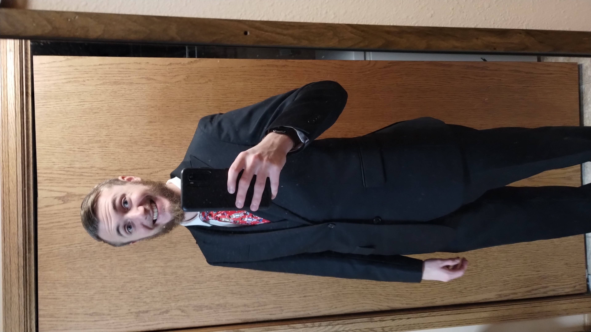
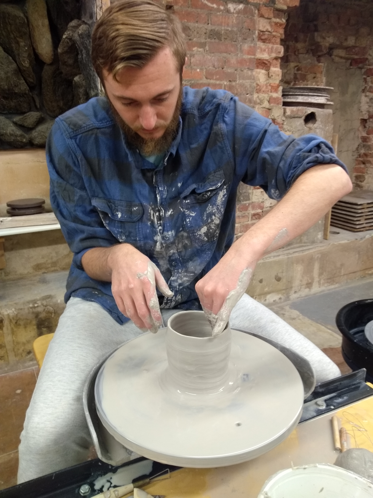

Contact Information can be found [here](contact.md).

You can find my resume [here](resume.md)

My LinkedIn can be accessed [here](https://www.linkedin.com/in/nathan-drees-9b247a1ab/).

My GitHub page can be found [here](https://github.com/nndrees).

## Biography

Since graduating from St John’s University, I have accrued a lot of relevant practice and experience through my latest endeavors. 

Most recently, I have been working as a Pharmacy Technician at Sanford Inpatient Pharmacy in Bismarck. I learned how to be more detailed oriented as mistakes could have devastating effects on the patients we are serving. Also, this job requires us to be extremely trustworthy as hundreds of thousands of dollars of products are passed through our hands, the ordering of the products, and the handling of controlled substances. A requirement of this job is humility as many double-checks are put in place and any errors are often caught having people double-check your work is seen as essential to providing a safe experience for all our patients.

I served on the Turtle Mountain Reservation in North Dakota with the Society of Our Lady of the Most Holy Trinity in Belcourt, North Dakota. The reservation is located in the middle of the state about ten miles from the Canadian border and is home to the Ojibwe and Métis people. I was assigned to the elementary school we served. I had the opportunity to implement several skills, as well as step into leadership roles. Some of my responsibilities involved driving the bus, cleaning the school, and managing the I.T. department. Some of my accomplishments in this position include leading a crew to install Smart Boards in our classrooms, ordering a computer cart for the school, installing new computers in each classroom, and many other things. In addition to my leadership and I.T. positions, I was the seventh and eighth-grade math teacher. Every role involved patience and clear communication with and respect for every individual assigned to the school, and I grew in my understanding of how to work on a team, all while maintaining the finesse of the technical workings of my own job. 

The community life was fantastic and note-worthy. I was one of fourteen volunteers at the mission, young people close in age to myself who were passionate about mission and the Catholic faith. I was also surrounded by priests, religious sisters, and religious brothers. Their joyful work, mutual respect, and compassion for others were highly influential in my character formation and work ethic.

 I deeply desire to take what I have learned from this place into the world: working hard for the betterment of myself and the people around me and always looking to challenge myself to greater accomplishment. 

